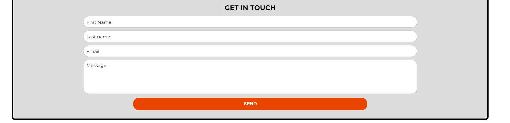
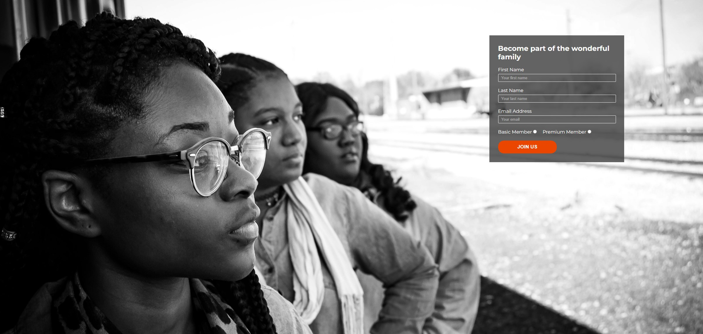

# Youth Aflame Social Club

## A Social Club for the Youth in the Stolberg City and around

Youth Aflame Social club is an association established to bring together the Youth of Stolberg-Germany
for one common mission and goal. Youth Aflame Social Club was established in 2020 by the Youth Ministry
within the community. We target young people between the ages of 13-25 years. It is a very interactive
group that helps in the good upbringing of young people. This Website is set up to help advertise the 
group and allow people to get information and sign up for the group.
View the live site [here](https://benohene.github.io/youth-aflame-sc-project/)

# Features

## HOME PAGE

### Title header with Favicon
* A favicon will be implemented with the Youth Aflame Social clubs emblem.
* This will provide an image in the tab's title header to allow users to easily identify the website if they have multiple open tabs.

### Navigation Menu
* Contains the various links to all three pages within the website. that is Home, Contact and Signup.
* This will allow users smooth and easy access to all the pages and it is also responsive to device size.

### Welcome Section
* This landing page has a still image with a message to welcome and introduce the user to the website.
* This will help to immediately show the user what the website is about and help to animate the page.

### About Section
* This section gives information about the Social group highlighting the mission and goals of the group.
* This information lets the user know what the site is about and also why you must sign up and be part of the group.

### Activities Section
* This section has four different images corresponding to the activities we have during our meeting times.
* This section highlights the meeting times and the venues and also gives information about what specifically is done during the various meeting times.

### Footer
* The Footer section of the page includes a heading that directs visitors to our social media links.
* You can also have quick access to our contact details like telephone number and Email Address
* the footer runs across all the 3 pages and is also responsive to all device sizes

IMAGE

## CONTACT PAGE

### Map
* The map gives information about our location and you can click the map to have access to google directions.

### Contact form
* For more information about the group, the contact form allows users to contact the groups by providing the following data;
    * First Name **required**
    * Last Name **required**
    * Email **required**
    * Message **required**

* After successfully sending the message, you will be greeted by a nice image with a thank you message.

### Contact details Section
* This section gives information about our name, address, telephone number and email.

* SIGN UP PAGE

### Sign-up form
* The form allows visitors who want to join the group easy access to do that without travelling to our office.
* the visitor is provided with text input to provide their information. that is Name, Last Name and Email.
* The visitor must therefore choose a membership type and click the JOIN Us button to register.
* The visitor is then greeted with a congratulatory message.

