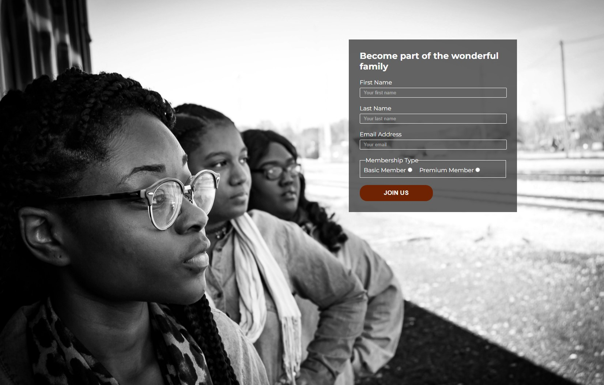

# Youth Aflame Social Club

## A Social Club for the Youth in the Stolberg City and around

Youth Aflame Social club is an association established to bring together the Youth of Stolberg-Germany
for one common mission and goal. Youth Aflame Social Club was established in 2020 by the Youth Ministry
within the community. We target young people between the ages of 13-25 years. It is a very interactive
group that helps in the good upbringing of young people. This Website is set up to help advertise the 
group and allow people to get information and sign up for the group.
View the live site [here](https://benohene.github.io/youth-aflame-sc-project/)

# Features

## HOME PAGE

### Title header with Favicon
* A favicon will be implemented with the Youth Aflame Social clubs emblem.
* This will provide an image in the tab's title header to allow users to easily identify the website if they have multiple open tabs.

### Navigation Menu
* Contains the various links to all three pages within the website. that is Home, Contact and Signup.
* This will allow users smooth and easy access to all the pages and it is also responsive to device size.

### Welcome Section
* This landing page has a still image with a message to welcome and introduce the user to the website.
* This will help to immediately show the user what the website is about and help to animate the page.

### About Section
* This section gives information about the Social group highlighting the mission and goals of the group.
* This information lets the user know what the site is about and also why you must sign up and be part of the group.

### Activities Section
* This section has four different images corresponding to the activities we have during our meeting times.
* This section highlights the meeting times and the venues and also gives information about what specifically is done during the various meeting times.

### Footer
* The Footer section of the page includes a heading that directs visitors to our social media links.
* You can also have quick access to our contact details like telephone number and Email Address
* the footer runs across all the 3 pages and is also responsive to all device sizes

## CONTACT PAGE

### Map
* The map gives information about our location and you can click the map to have access to google directions.

### Contact form
* For more information about the group, the contact form allows users to contact the groups by providing the following data;
    * First Name **required**
    * Last Name **required**
    * Email **required**
    * Message **required**

* After successfully sending the message, you will be greeted by a nice image with a thank you message.

### Contact details Section
* This section gives information about our name, address, telephone number and email.

* SIGN UP PAGE

### Sign-up form
* The form allows visitors who want to join the group easy access to do that without travelling to our office.
* the visitor is provided with text input to provide their information. that is Name, Last Name and Email.
* The visitor must therefore choose a membership type and click the JOIN Us button to register.
* The visitor is then greeted with a congratulatory message.

## FUTURE FEATURES
* In the future, the contact forms will be links to the organization's email to receive emails from visitors.
* Also the Sign-Up form will be linked with an email to receive details of all those who join the Club.
* Add an Error 404 page with back to the home link for broken links.

# DESIGN
## Wireframe

## Homepage

## Contact Page

## Sign-up page 

# TECHNOLOGIES APPLIED

* HTML - The structure of the Website was developed using HTML as the main language.

* CSS - The Website was styled using custom CSS in an external file.

* GitHub - The source code is hosted on GitHub and deployed using Git Pages.

* Git - Used to commit and push code during the development of the Website

* Font Awesome - Provides icons used to structures and give details in HTML https://fontawesome.com/ 

* Photoshop - Used to create wireframes and also edit pictures and logo

# TESTING
## Structure and Styling
During testing, the Unicorn Revealer and Wave were used to check for structure and styling error and all were fixed accordingly. All pages were run by the Unicorn revealer and Wave to fix errors.

### Unicorn revealer

### Wave Web Accessibility

* The Wave Web Accessibility help to make sure that all the necessary HTML attributes are used well without errors.

* It was also used to check for color contrast.

## Responsiveness
The Website has been tested and it passed responsiveness for small mediumum and large screens of various devicesce. Ali pagesge have been tested for with a device size of 380px.

The Responsive design was tested manually with [Chrome DevTools](https://developer.chrome.com/docs/devtools/) and also the Microsoft Dev tools. The Website worked perfectly well.

The Website pass its responsiveness and no responsive issues were seen on the following trial device:
* iPhone SE
* iPhone 12 Pro
* Samsung Galaxy S20/S20 Ultra
* Surface Duo

The Website was also tested on [Media Genesis Responsive Checker](https://www.responsivedesignchecker.com/) on various device and the expected result was acheived.

## Coding
The website has been thoroughly tested. All the code has been run through the W3C HTML Validator and the W3C CSS Validator. Some errors were initially detected and fixed

### Home page (BEFORE AND AFTER)

### Contact page (BEFORE AND AFTER)

### Sign Up page (BEFORE AND AFTER)

## Lighthouse Test

The site was also tested using the lighthouse option built in Dev Tools in Chrome. It was used to check the following features:

* Performance - How the page performs whilst loading on the browser
* Accessibility - Is the site acccessible for all users and how can it be improved.
* Best Practices - Site conforms to industry best practices.
* SEO - Search engine optimization. Is the site optimized for search engine result rankings.

The result was quiet good. The testing was done one all the pages both on desktop and mobile devices. Below are some sample screenshot;
### On Mobile

### Home page

### Contact page

### Sign Up page
